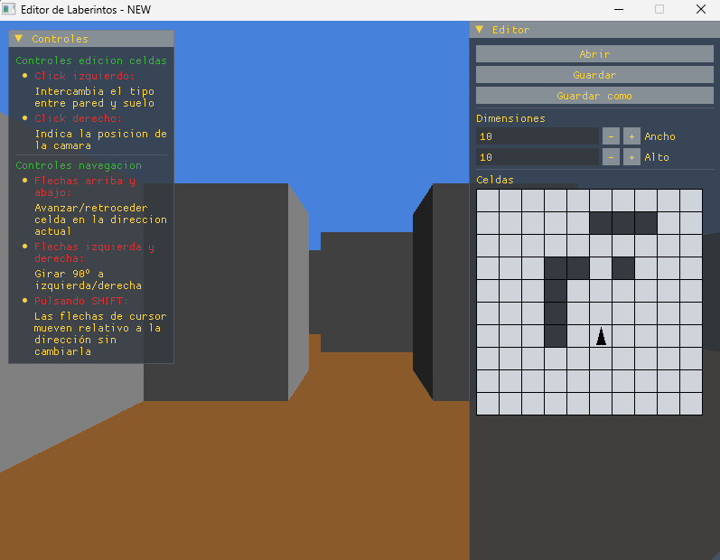

# EditorLaberintos

Editor simple de laberintos con navegación 3D. Los laberintos se define como una parilla de dimensiones configurables de celdas caudradas. Cada celda puede ser suelo (navegable) o pared (no navegable).

  

## Objetivo
El objetivo de este proyecto es comprobar la viabilidad de la creación de programas sencillos en C++ especificándolo mediante la metodología SDD (Spec driven development) y su implementación mediante un asiste de IA (concretamente DeepSeek V4 Flash).

En sí mismo el programa no tiene ningúna aplicación práctica, aunque podría ser utilizado como base para la creación de un program de diseño de niveles en el desarrollo de un videojuego.

## Funcionalidad
### Interfaz
El programa presenta una interfaz simple e intutiva para que el usuario edite un laberinto. En concreto puede:
* Guardar el trabajo en un archivo local en disco o recuperar uno anteriormente guardado
* Especificar las dimensiones del laberinto en celdas (entre 1 y 30 en horizontal y vertical)
* Especificar por cada celda si es suelo o pared
* A la izquierda se incluye una leyenda de los controles
### Navegación
Al fondo se muestra una vista en 3D del laberinto para que el usuario pueda navegar en primera persona

## Tech stack
Esta aplicación ha sido desarrollada en Visual Studio code sosteniéndose sobre las siguientes tecnologías:
* MinGW-w64 via MSYS2 ([Instrucciones de instalación](https://code.visualstudio.com/docs/cpp/config-mingw))
* Librería [SDL3](https://github.com/libsdl-org/SDL) para gestión de ventanas, dibujado y controles
* Librería [Dear ImGUI](https://github.com/ocornut/imgui) para gestión de la interfaz de usiario

## Instrucciones de compialción
1. Primero debe instalarse MinGW-w64 via MSYS2 para Visual Studio Code
2. Después, en Visual Studo Code, debe ejecutarse la tarea de generación:
    1. Pulsar CTRL+SHIFT+P para abrir la paleta comandos
    2. Seleccionar el comando "Tasks: Run task"
    3. Seleccionar la tarea "build release + copy"

## Estructura del proyecto
El proyecto se divide en 3 carpetas:
* **external:** Contiene las librerías externas utilizadas (SDL3 y ImGUI)
* **header:** Contiene las cabeceras con las definiciones de las estructuras utilizadas en el código
* **source:** Contiene el código de la aplicación

A su vez, el código de la aplicación se divide en los siguentes módulos:
* **main:** Punto de entrada del programa
* **Maze:** Definición del laberinto
* **EditorInterface:** Interfaz de gestión de archivos y edición del laberinto
* **ControlsLegend:** Interfaz que muestra la leyenda de los controles
* **NavigationManager:** Gestiona la posición y orientación actual, respondiendo al input de teclado para modificarla
* **NavigationMarker:** Gestiona el marcador triangular que muestra dentro de la parrilla de celdas de la interfaz la posición y orientación actual del navegador
* **Maze3DRenderer:** Renderiza en el fondo de la ventana una vista 3D del laberinto desde el punto de vista del navegador (o un mensaje de error si se encuentra en una posicón incorrecta)

## Problemas concidos:
* La interfaz no sigue correctamente las reglas especificadas por la skill window-design
* La vista en 3D está deformada. Provablemente no se está teniendo en cuenta el aspect ratio de la ventana
* La animación de movimiento puede verse interrumpida dependiendo de las teclas pulsadas
